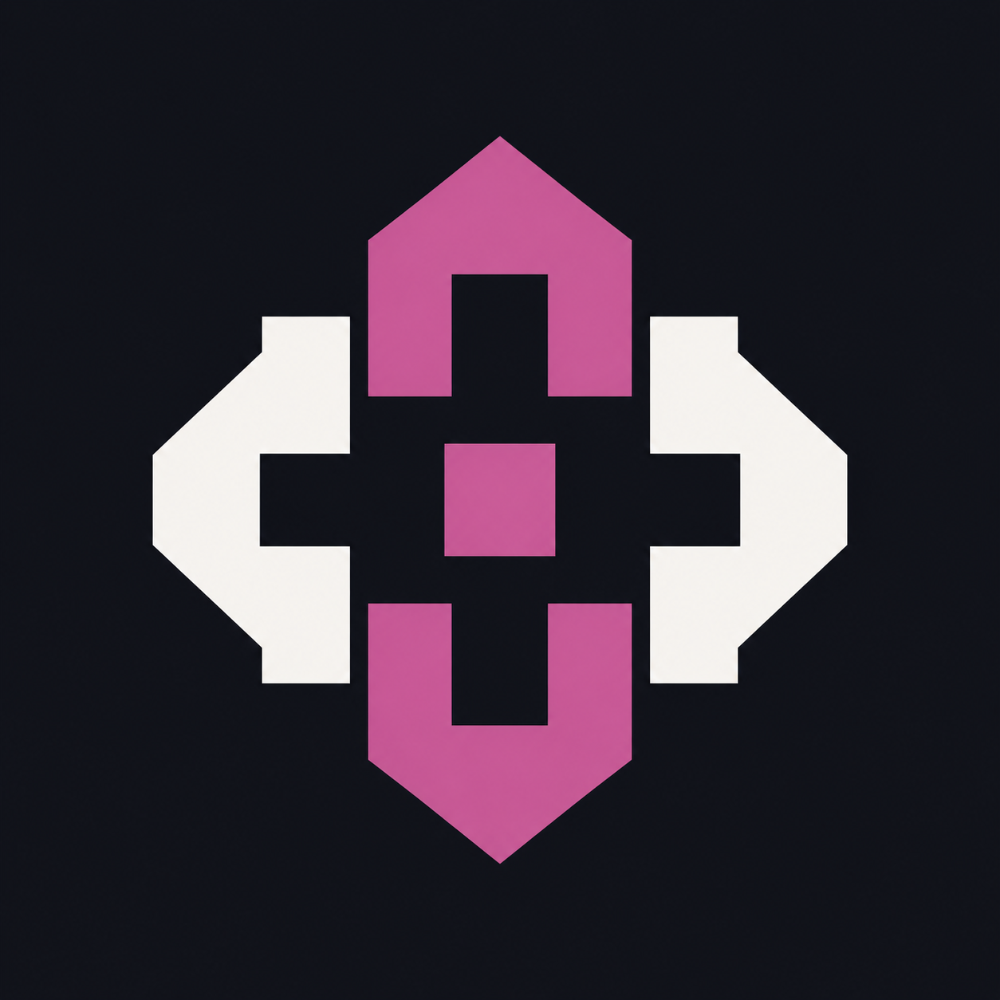

# Berkin Efe Avcı

I build practical macOS apps with Swift and SwiftUI.

## Apps

### [Cellkeep](https://github.com/berkinefeavci/cellkeep)

Open-source battery care for Apple Silicon MacBooks: macOS charge-limit settings, live power flow, and battery history.

[Download](https://github.com/berkinefeavci/cellkeep/releases/latest) · [Install with Homebrew](https://github.com/berkinefeavci/homebrew-cellkeep) · [Screenshots](https://github.com/berkinefeavci/cellkeep/tree/main/docs/screenshots) · [Report an issue](https://github.com/berkinefeavci/cellkeep/issues)

### [SesCam](https://github.com/berkinefeavci/sescam)

Dictation and live captions for macOS, with local speech options and optional AI editing. Limited beta available for Apple Silicon Macs.

[Download beta](https://github.com/berkinefeavci/sescam/releases/tag/v0.30.2-beta.1) · [How it works](https://github.com/berkinefeavci/sescam#readme) · [Data use](https://github.com/berkinefeavci/sescam/blob/main/PRIVACY.md) · [Report an issue](https://github.com/berkinefeavci/sescam/issues)

## Open source

[DockDoor preview-title fix](https://github.com/ejbills/DockDoor/pull/1618) — pull request under review.

---

Mac için pil bakımı, dikte ve canlı altyazı uygulamaları geliştiriyorum. Cellkeep açık kaynaklı ve indirilebilir. SesCam'in sınırlı beta sürümü indirilebilir.
